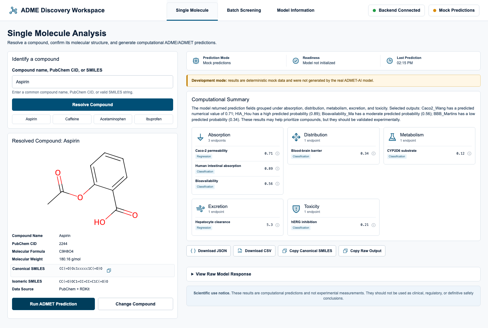

# ADME Dialog Agent

A local-first, human-in-the-loop workspace for exploring computational
ADME/ADMET predictions through visual and controlled conversational workflows.

**Research Preview · v0.1.0 · MIT · Local-first**

[Quick start](#quick-start) ·
[Scientific responsibility](#scientific-responsibility) ·
[Documentation](#documentation) ·
[Contributing](#contributing) ·
[Roadmap](ROADMAP.md)



> **Research Preview:** This project supports education, software development,
> and exploratory research. Its outputs are computational predictions, not
> experimental measurements or clinical, regulatory, safety, or
> candidate-selection conclusions.

## Why this project

ADME/ADMET tools often require users to assemble Python, API, model, and batch
workflows before they can inspect a result. ADME Dialog Agent brings structure
confirmation, predictions, endpoint metadata, comparison, and export into one
workspace without hiding model provenance or transferring scientific
responsibility to an LLM.

### Transparent ADME exploration

- Resolve a compound name, PubChem CID, or SMILES string and confirm its
  structure before prediction.
- Run single-compound or batch ADME/ADMET predictions.
- Inspect raw values, endpoint metadata, model mode, and provenance.
- Compare compatible endpoint values without an overall ranking or winner.

### Controlled scientific copilot

- Use natural language to navigate, search, filter, inspect, and compare.
- Require explicit confirmation before prediction, batch execution, export, or
  deletion.
- Ground explanations in structured tool output.
- Reject unsupported clinical, safety, regulatory, and candidate-ranking
  conclusions.

### Local-first workflow

- Run deterministic mock predictions and normal tests without an API key.
- Keep sessions, audit events, uploads, jobs, and results in local storage.
- Configure an optional OpenAI-compatible Responses API on the backend.
- Collect no product telemetry by default.

## Who it is for

The primary audience is early-stage drug-discovery researchers who have one or
more candidate compounds but do not want to build a custom prediction and
batch-processing workflow first. Students in medicinal chemistry,
cheminformatics, and related fields are a secondary audience.

The project also welcomes contributors in scientific validation, Agent safety
and evaluation, frontend accessibility, backend engineering, testing, and
documentation.

## Core workflow

```text
Input compound
-> resolve and confirm structure
-> run prediction
-> inspect raw values, metadata, and provenance
-> filter or compare compatible endpoints
-> export results
```

## Human-Agent boundary

| Agent behavior | Policy |
| --- | --- |
| Explain endpoint metadata and visible page state | Allowed automatically |
| Search, filter, select, and navigate | Allowed when reversible |
| Resolve a compound and show the resulting structure | Allowed; the user confirms the structure |
| Run a prediction or batch job | Explicit confirmation required |
| Export results or delete local state | Explicit confirmation required |
| Compare compatible raw endpoint values | Allowed without ranking or a winner |
| Make clinical, safety, regulatory, or candidate-selection claims | Prohibited |
| Run arbitrary code, shell commands, or file operations | Prohibited |

The Agent assists with workflow and understanding. The user remains responsible
for scientific interpretation and every downstream decision.

## Quick start

The most reproducible path requires Docker Desktop or Docker Engine with
Compose 2.22 or newer:

```bash
docker compose up --build
```

This starts the whole application in deterministic Mock Mode without an API
key. For native development, use the pinned contributor toolchain:

- uv 0.11.32
- Python 3.11.15 (read from `.python-version`)
- Node.js 22.23.1 (read from `.nvmrc`)
- npm

Check the versions before installing:

```bash
uv --version
uv run python --version
node --version
npm --version
```

```bash
# After cloning the repository:
cd adme-dialog-agent
make setup
make dev
```

See the [reproducible contributor environment](docs/contributor-environment.md)
for Docker and native cold starts, incremental workflows, supported platforms,
and disposable data handling.

Open:

- Single molecule workspace: `http://localhost:3000/single`
- Batch screening: `http://localhost:3000/batch`
- Model information: `http://localhost:3000/about`
- Backend API docs: `http://127.0.0.1:8000/docs`

The Docker environment and `.env.example` both keep the Agent disabled and use
mock predictions, so the first run does not need a model-provider API key.

## Architecture

- `app/tools/smiles.py`: rule-based SMILES extraction and validation, with optional RDKit canonicalization.
- `app/tools/admet_predictor.py`: lazy ADMET-AI wrapper, JSON serialization, batch prediction, and deterministic mock mode.
- `app/tools/compound.py`: direct-SMILES resolution plus PubChem name/CID lookup and RDKit structure rendering.
- `app/tools/endpoints.py`: conservative endpoint metadata used by prediction detail disclosures.
- Endpoint registry schema 2.0 covers the 104 fields observed from ADMET-AI 2.0.1, preserves raw values, and separates descriptors, counts, rules, model probabilities, regressions, and DrugBank percentiles.
- `app/formatter.py`: keyword-based grouping into absorption, distribution, metabolism, excretion, toxicity, and other.
- `app/agent_runtime/`: optional OpenAI Agents SDK runtime with allow-listed
  scientific tools, confirmation gates, bounded sessions, and redacted local
  audit events. It is disabled by default.
- `app/main.py`: FastAPI routes for health, compound resolution, endpoint metadata, prediction, batch prediction, and chat.
- `frontend/`: Next.js 16 App Router workspace with `/single`, `/batch`, and `/about` routes.
- `app/tools/batch.py`: safe CSV/TSV/SMI parsing, row validation, local UUID jobs, progress, cancellation, and exports.
- `docs/`: current product references and historical implementation records.

```text
Next.js frontend
        |
        v
FastAPI API -> deterministic services -> ADMET-AI or mock predictor
        |
        +-> bounded Agent runtime -> user-configured Responses API
```

RDKit is optional for stronger SMILES validation and canonicalization. If RDKit is not installed, the project uses a lightweight fallback validator. Install RDKit separately only if your platform supports it cleanly.

## Smoke Test ADMET-AI

These scripts use the real `ADMET-AI` package and may fail if model dependencies are unavailable locally.

```bash
python scripts/smoke_test_admet.py
python scripts/inspect_admet_keys.py
```

`inspect_admet_keys.py` prints raw output keys one per line and writes `examples/sample_outputs.json`.

## Mock Mode

Use mock mode for local development and unit tests when ADMET-AI is not installed or cannot load its model.

```bash
export ADME_MOCK_MODE=true
```

Mock mode returns deterministic sample fields such as `Caco2_Wang`, `HIA_Hou`, `BBB_Martins`, `CYP2D6_Substrate_CarbonMangels`, `Clearance_Hepatocyte_AZ`, and `hERG`.

## Run Tests

```bash
make verify
```

The default gate covers documentation, backend, deterministic Agent, frontend,
and production-build checks. Browser E2E and real-model checks remain separate:

```bash
cd frontend && npm run test:e2e
make smoke-real
```

## Batch Screening

Open `http://localhost:3000/batch` and upload a UTF-8 CSV, TSV, or SMI file.
The SMILES column is required; compound ID and name are optional. Limits are 5
MB and 5,000 rows. Validation preserves invalid, missing, and duplicate rows,
while each unique canonical SMILES is predicted once.

```bash
make batch-demo
```

Local jobs are written under `data/jobs/`. This in-process worker and local-file
storage are suitable for development only: they do not provide durable queues,
multi-process coordination, or hard interruption of an active ADMET-AI call.

### Batch Assistant

The Assistant docks to the left of an open Batch job on desktop and falls back
to a right-side overlay on narrower screens. It receives live, bounded page
context and can apply allow-listed search, filter, endpoint, range, row
selection, neutral comparison, and export actions. Batch comparisons display
raw endpoint values side by side and never produce an overall ranking or
winner.

Configure an OpenAI-compatible Responses API through backend-only environment
variables when using model-driven summaries or tool calls. The model ID and
base URL depend on the provider:

```bash
export AGENT_ENABLED=true
export AGENT_LLM_BASE_URL=https://your-provider.example/v1
export AGENT_LLM_API_KEY=replace-with-your-api-key
export AGENT_LLM_MODEL=replace-with-your-model-id
```

Keep these values in the backend `.env` file. Never put a provider credential
in `frontend/.env.local` or in a `NEXT_PUBLIC_*` variable because those values
are delivered to the browser.

After configuring the provider, start the backend with the Agent enabled. Real
ADMET-AI predictions are opt-in:

```bash
AGENT_ENABLED=true ADME_MOCK_MODE=false make backend
make frontend
```

Useful Batch Assistant checks include `找到 ibuprofen`, `只显示失败的分子`,
`比较第1行和第4行`, and `导出当前筛选结果`. Starting or cancelling a Batch
job creates a single-use confirmation card; the job service is called only
after explicit approval.

## Run mock development mode

```bash
export ADME_MOCK_MODE=true
make dev
```

Ctrl+C shuts down both services. Run `make backend` or `make frontend` when only
one service is needed.

## Review proposed changes without an API key

The repository includes a temporary PR Review App configuration for
human-visible product review. It uses the real frontend, API, streaming
contract, confirmations, and evidence cards with five deterministic Mock Agent
scenarios. It never needs an LLM provider credential and it remains visibly
labeled as a non-production preview.

See [PR Review App](docs/review-app.md) for the reviewer workflow, cost boundary,
and Render setup. Creating or publishing a preview still requires an authorized
repository administrator and a Render Pro workspace.

For the professor-facing five-minute flow, plain-language terminology, failure
fallbacks, and FOSS evidence, see the
[course demonstration guide](docs/course-demonstration-guide.md).

The default ports are 8000 for FastAPI and 3000 for Next.js. To avoid a local
port conflict without stopping another project, choose both ports together:

```bash
ADME_MOCK_MODE=true BACKEND_PORT=8100 FRONTEND_PORT=3100 make dev
```

The launcher automatically points the frontend at the selected backend port.

### macOS background demo mode

To keep the frontend and backend running after the terminal closes, use the
optional macOS `launchd` helper:

```bash
scripts/demo_services.sh start
scripts/demo_services.sh status
scripts/demo_services.sh stop
```

Logs are written under `data/demo-logs/`. These jobs continue for the current
macOS login session and stop when explicitly requested, at logout, or at
shutdown. Run `start` again after restarting the Mac. This helper does not
install or start an LLM provider. If the Agent is enabled, configure and start
your chosen provider separately.

## Run Real Prediction Mode

```bash
export ADME_MOCK_MODE=false
make smoke-real
make dev
```

The first real request initializes the local model and may be slower. The UI
shows whether mock or real mode produced a result.

## Development Commands

```text
make setup       create/validate .venv and install backend/frontend dependencies
make test        run normal backend tests in mock mode
make test-unit   run focused backend logic tests
make test-api    run FastAPI route tests
make smoke-mock  run one deterministic prediction
make smoke-real  run one real ADMET-AI prediction
make backend     start FastAPI on port 8000
make frontend    start Next.js on port 3000
make dev         start and stop both services together
make verify      run the default documentation, backend, Agent, and frontend gate
make check       compatibility alias for make verify
make container-up     build and start the pinned Compose environment
make container-watch  start Compose with incremental source synchronization
make verify-container run the default gate in pinned containers
```

Run `make dev-check` for a beginner-readable environment and port report.

## API Examples

Health check:

```bash
curl http://127.0.0.1:8000/health
```

Development status:

```bash
curl http://127.0.0.1:8000/status
```

Resolve a compound name, PubChem CID, or SMILES:

```bash
curl -X POST http://127.0.0.1:8000/compound/resolve \
  -H "Content-Type: application/json" \
  -d '{"query": "Aspirin"}'
```

Direct SMILES resolution is local. Name and CID resolution uses PubChem and
therefore requires network access.

Prediction request:

```bash
curl -X POST http://127.0.0.1:8000/predict \
  -H "Content-Type: application/json" \
  -d '{"smiles": "CC(=O)OC1=CC=CC=C1C(=O)O"}'
```

Chat request:

```bash
curl -X POST http://127.0.0.1:8000/chat \
  -H "Content-Type: application/json" \
  -d '{"message": "Predict ADME properties for aspirin: CC(=O)OC1=CC=CC=C1C(=O)O"}'
```

Batch request:

```bash
curl -X POST http://127.0.0.1:8000/predict/batch \
  -H "Content-Type: application/json" \
  -d '{"smiles_list": ["CC(=O)OC1=CC=CC=C1C(=O)O", "O=C(O)c1ccccc1"]}'
```

## Scientific responsibility

The project supports exploration and understanding of computational
predictions. It does not make experimental, clinical, regulatory, safety, or
candidate-selection decisions. Higher or lower model output must not be
silently translated into better or worse without validated endpoint semantics.

See the [project positioning](docs/project-positioning.md) and
[computational summary rules](docs/computational-summary-rules.md) for the
normative product boundary.

## Privacy and external communication

- Sessions, audit events, uploads, batch jobs, and results are local by default.
- Name and CID resolution may send the entered identifier to PubChem.
- Direct SMILES handling and mock prediction can run without PubChem.
- When the optional Agent is enabled, bounded task context is sent to the
  provider selected by the person running the project.
- The project collects no product telemetry by default.

Do not use confidential molecular data with an external provider until you
have reviewed that provider's privacy and retention terms. See
[SECURITY.md](SECURITY.md) for secret and vulnerability reporting guidance.

## Troubleshooting

- **uv version mismatch:** install uv 0.11.32; `pyproject.toml` intentionally
  rejects other uv versions so lockfile behavior is reproducible.
- **Virtual environment missing:** run `make setup`; uv creates `.venv` from
  the committed Python and dependency locks.
- **Port already in use:** either stop the service using port 3000 or 8000, or
  run `ADME_MOCK_MODE=true BACKEND_PORT=8100 FRONTEND_PORT=3100 make dev`.
- **Backend unavailable:** run `make backend`, then check `/status`.
- **CORS failure:** use `http://localhost:3000` or `http://127.0.0.1:3000` and
  keep `NEXT_PUBLIC_API_BASE_URL=http://127.0.0.1:8000`.
- **Real model load failure:** run `make smoke-real` and read the backend
  terminal. The API returns a safe structured error while full diagnostics stay
  in the terminal.
- **First prediction slow:** real mode loads model assets on first use; wait for
  the request rather than submitting again.
- **Node version mismatch:** use Node 22.23.1, the version pinned for local,
  container, and CI workflows.
- **Frontend environment missing:** copy `frontend/.env.example` to
  `frontend/.env.local` when using a non-default backend URL.
- **Mock mode unexpectedly active:** set `ADME_MOCK_MODE=false` in `.env` or
  export it before starting the backend.

## Documentation

- [Documentation index](docs/README.md)
- [Project positioning](docs/project-positioning.md)
- [Testing guide](docs/testing-guide.md)
- [Agent documentation](docs/agent/00_README_AGENT_DOCS.md)
- [ADME evidence RAG](docs/evidence-rag.md)
- [Roadmap](ROADMAP.md)

## Contributing

Contributions are welcome from scientific, engineering, design,
accessibility, testing, and documentation perspectives. Scientific claims
require evidence; changes that expand Agent autonomy require explicit safety
tests.

Read [CONTRIBUTING.md](CONTRIBUTING.md), the
[Code of Conduct](CODE_OF_CONDUCT.md), and [SECURITY.md](SECURITY.md) before
submitting work.

## Citation

The prediction backend is built around
[ADMET-AI](https://github.com/swansonk14/admet_ai). If it is useful in
research, cite:

> Kyle Swanson, Parker Walther, Jeremy Leitz, Souhrid Mukherjee, Joseph C. Wu,
> Rabindra V. Shivnaraine, and James Zou. "ADMET-AI: A machine learning ADMET
> platform for evaluation of large-scale chemical libraries."
> <https://doi.org/10.1101/2023.12.28.573531>

See [THIRD_PARTY_NOTICES.md](THIRD_PARTY_NOTICES.md) for key direct
dependencies and their licenses.

## License

ADME Dialog Agent is available under the [MIT License](LICENSE). Third-party
software, models, datasets, services, and media remain subject to their own
licenses and terms.
