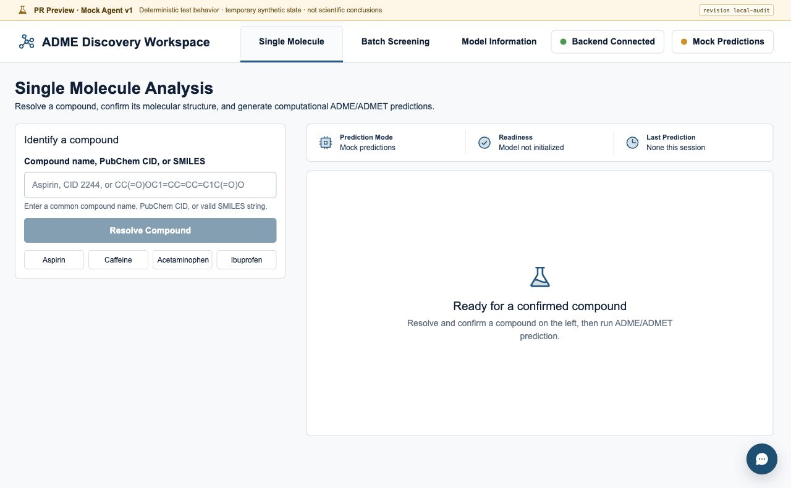
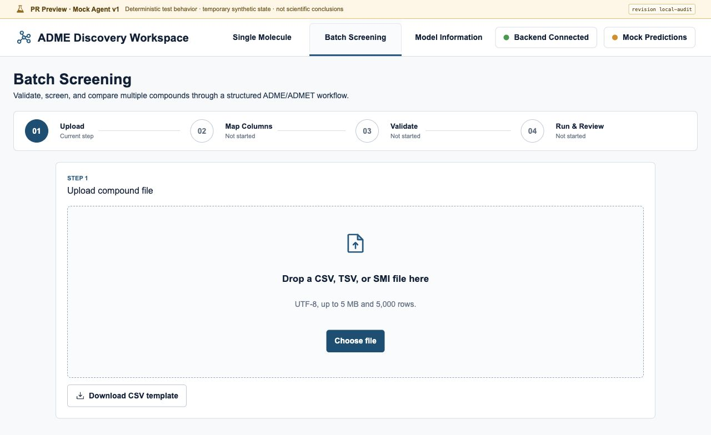
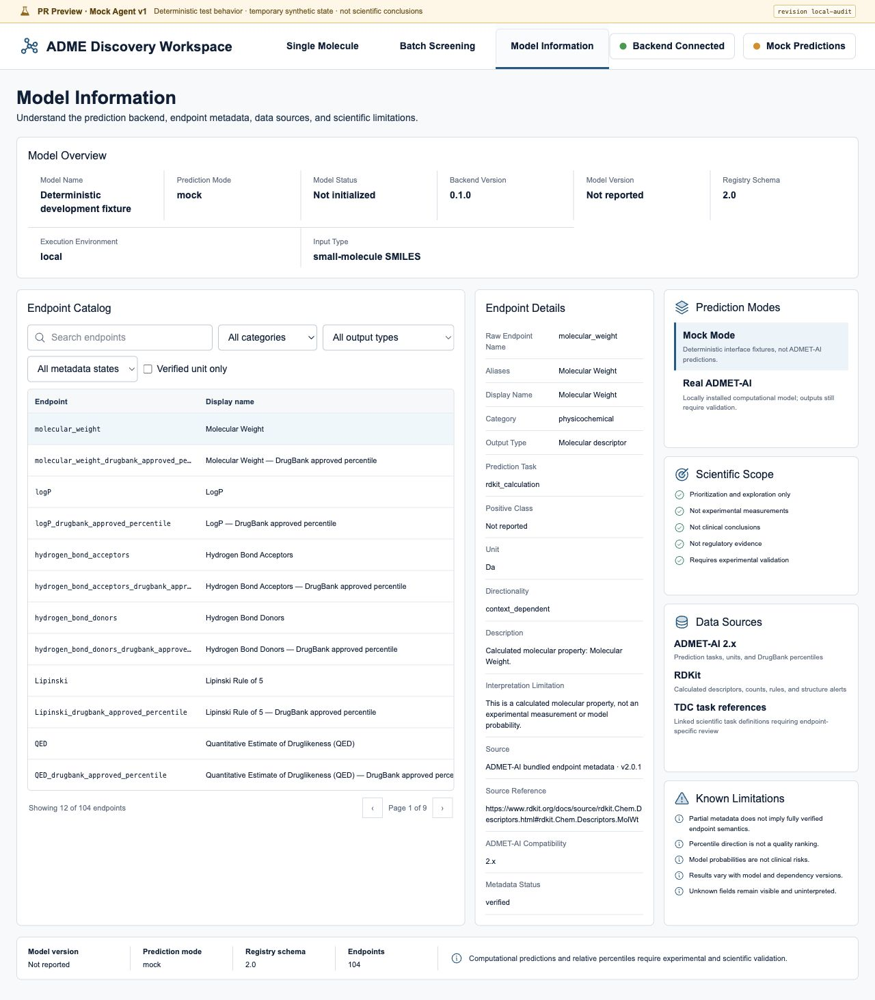
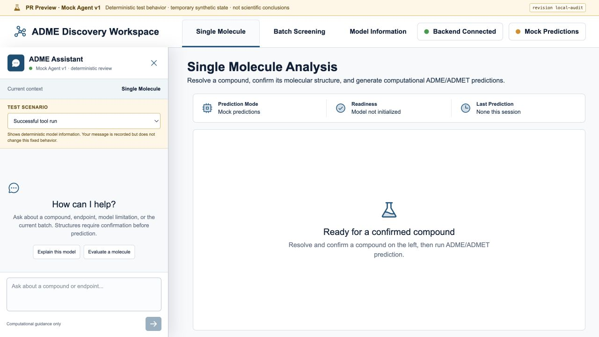
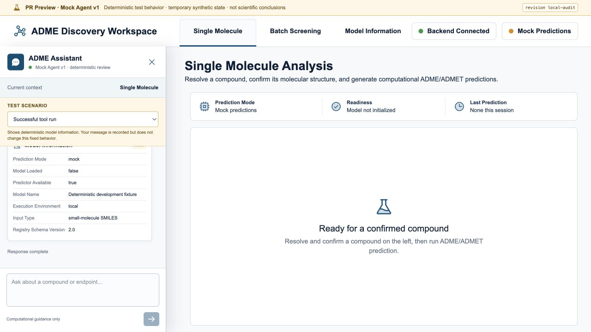
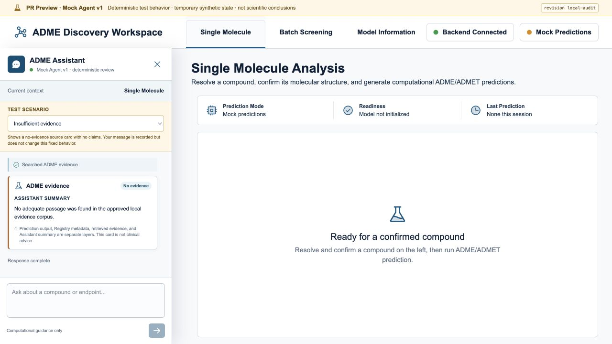
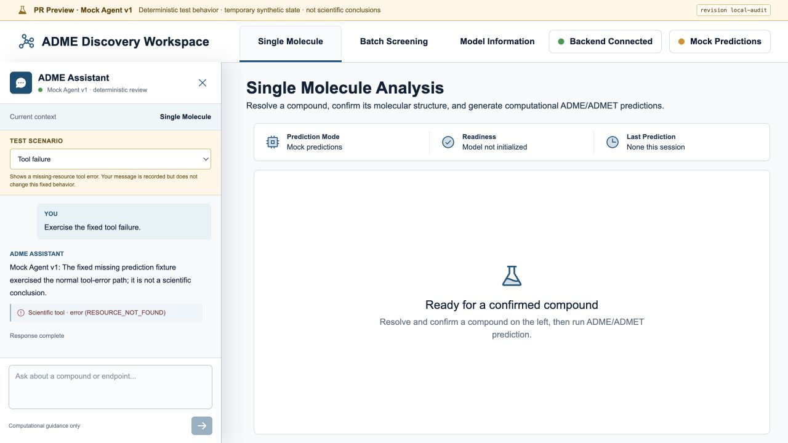
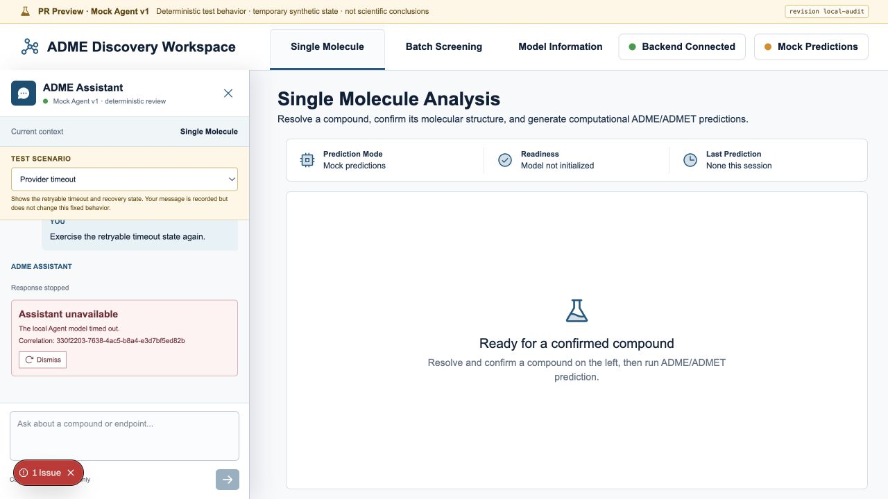
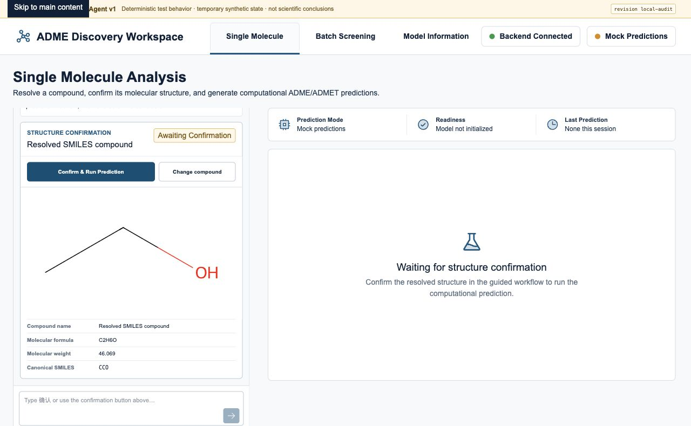
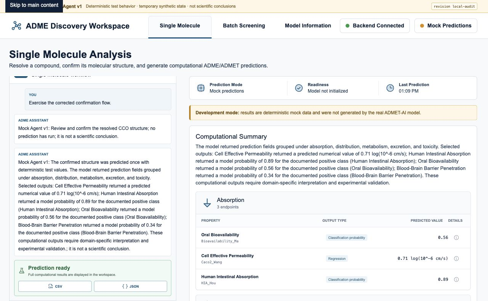

# Issue #9 Product Experience Audit

**Audit date:** 2026-08-04

**Source baseline:** `6cdaf80a5c7a99663bc9cf05a2e5c41ab4ec4f30` plus the uncommitted Issue #8, Mock Agent, and Review App work described by `git diff`

**Audit environment:** local Next.js Review Mode and local FastAPI with `AGENT_PROVIDER_MODE=mock`

**Browser:** the user's Codex in-app browser at a 1280-pixel desktop viewport

**Outcome:** local product-review flow passes after the fixes below; the real Render HTTPS preview remains an external provisioning gate

## What was reviewed

This audit focused on what a professor, product reviewer, or contributor would
actually experience:

- first visit to Single Molecule, Batch Screening, and Model Information;
- whether the Review App is obviously different from production;
- whether Mock Agent behavior is reproducible and understandable;
- success, timeout, tool-failure, insufficient-evidence, and confirmation paths;
- confirmation before prediction;
- streaming, structured cards, scientific boundaries, and recovery after error;
- whether the visible source revision and Mock labels stay present across pages.

The in-app browser used the real local frontend and API. Agent requests were not
intercepted or replaced in the browser.

## Evidence

### Review boundary and first-use screens

The banner, backend status, Mock Predictions status, and source revision are
visible. Navigation and page headings use the same visual system as the existing
product.

### Explicit Mock behavior

The reviewer selects a named, versioned scenario. The interface explicitly says
that message text is recorded but does not alter fixed behavior.

### Safety and failure states

The no-evidence card contains no claims. The tool failure names its normal error
code. The timeout remains visible, is dismissible, and does not silently retry.

### Human confirmation and prediction

The fixed `CCO` structure is displayed before prediction. Prediction runs only
after explicit approval, remains labeled Mock, and reports a visible last-run
time. The revised summary requires domain-specific interpretation and
experimental validation.

## Findings corrected during this audit

| Severity | Finding | Correction and evidence |
| --- | --- | --- |
| P1 | A timeout advanced backend session state but the frontend kept the old version, so the next request failed as stale. | After a stream error, the frontend performs one read-only session refresh. The browser completed `timeout -> dismiss -> confirmation` without an automatic resend. |
| P1 | The strict stream schema rejected the two hash-bound Mock confirmation markers, preventing the real confirmation flow from rendering. | The schema now accepts only the optional literal values `agent_provider_mode: mock` and `mock_catalog_version: 1`; a contract test covers the event. |
| P1 | Adding the scenario selector without adding a grid row caused the selector and messages to compete for layout space. | The Assistant grid now has five explicit rows. Final screenshots show separate scenario, message, and composer regions. |
| P2 | The docked Assistant started below the old 68-pixel header and overlapped the new review banner/header combination. | Review Mode provides a 101-pixel desktop dock offset while preserving the existing responsive overlay rule. |
| P2 | Opening or updating the fixed Assistant could scroll the whole document and hide the review banner. | Scrolling is now limited to the Assistant message container; the browser verified the document remained at `scrollY = 0`. |
| P2 | Timeout content could appear below the visible message region. | Error and stream-status changes now trigger message-container scrolling; the final timeout screenshot shows the full error and Dismiss action. |
| P2 | Assistant-guided prediction displayed results while `Last Prediction` still said `None this session`. | Guided prediction now updates the same visible timestamp as the manual flow. |
| P2 | The computational summary said results might support “prioritization,” which was broader than the repository's neutral-decision boundary. | The summary now says outputs require domain-specific interpretation and experimental validation; a backend assertion rejects the old wording. |

## Acceptance result

| Requirement | Result |
| --- | --- |
| Clearly labeled non-production preview | Pass locally |
| Exact visible source revision | Pass locally with `local-audit`; cloud value will use `RENDER_GIT_COMMIT` |
| No LLM provider key | Pass |
| Five deterministic scenarios | Pass in backend tests; all five observed through the in-app browser |
| Real frontend, API, stream, tools, and confirmation | Pass locally |
| No scientific conclusion from Mock output | Pass |
| Retryable error recovery without hidden resend | Pass |
| Temporary, isolated review state | Configured; cloud lifecycle not yet observed |
| Shareable HTTPS PR link | Not yet verified; requires authorized Render/GitHub setup |
| Narrow-screen visual review | Not captured in this fixed desktop browser viewport |

## Remaining external checks

Before calling the Review App fully operational:

1. an authorized maintainer must connect the repository to a paid Render Pro
   workspace and accept preview compute cost;
2. a real PR titled with `[render preview]` must produce a GitHub deployment and
   HTTPS link;
3. the displayed revision must match that PR's commit;
4. the preview must be observed updating after a push and disappearing after
   merge, close, title removal, or expiry;
5. a narrow-screen screenshot should be captured in the same in-app browser or
   another explicitly approved browser run.

No production deployment, secret, database migration, or real user data is
required for these checks.

## Screenshot integrity

The PNG evidence is stored under `docs/images/audits/issue-9/`. SHA-256 values
for the final key frames are:

- `single-empty-review.png`: `8fa704c8ce5e111c071ee875d3122d303d2a64bad1c6fb182a3fd421db229c49`
- `batch-empty-review.png`: `58de090347792167a7920138cf572c64dbe731508818fcccfa6a21958cbc93d1`
- `mock-confirmation.png`: `ccad7ece0250d22d31fdcbb6c711dfc0c253d35ea57a0d93bc1504b98b20c287`
- `mock-confirmed-prediction.png`: `a79e627b7792e6126829c063e7848fa2d5f28e8eb0d5323d569aac40430df252`

The later scenario screenshots may have different hashes from earlier audit
captures because the audit itself corrected layout and scrolling defects. Use
the files in the repository as the final evidence set.
