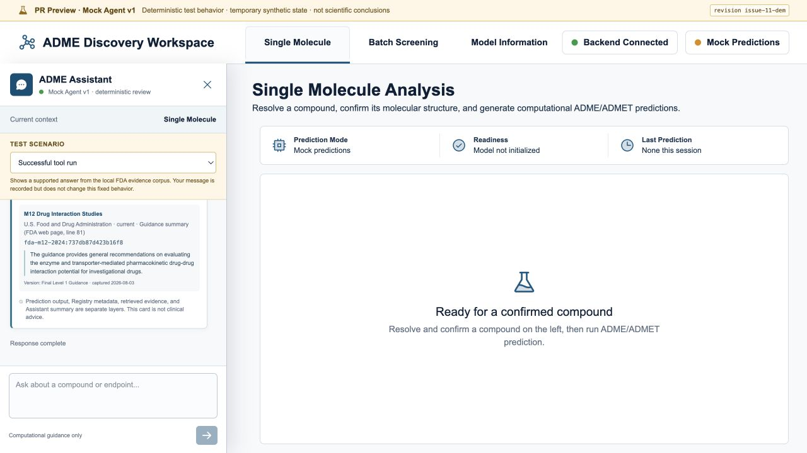
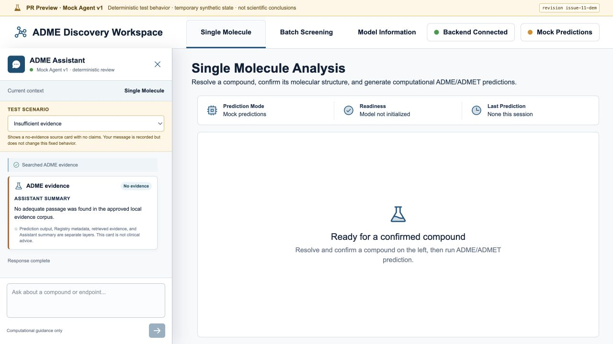

# Course Demonstration Guide

Issue: [#11 — Prepare the course demonstration and verification evidence](https://github.com/jichenggepeter-dev/adme-dialog-agent/issues/11)

Audience: a professor or class member who may not know drug-discovery terminology

Default format: five-minute core demonstration, followed by optional discussion

## The idea in plain language

Use this opening:

> ADME describes how a potential drug may be absorbed, distributed, metabolized,
> and excreted. ADMET adds toxicity. This project brings computational
> predictions, their field descriptions, and a constrained Assistant into one
> open-source workspace. It helps a person inspect software output; it does not
> replace laboratory experiments or make medical, safety, regulatory, or drug
> selection decisions.

Three terms may be unfamiliar:

- **SMILES** is a way to write a molecule as text. The fixed demonstration uses
  ethanol (`CCO`), a familiar small molecule that can be handled locally.
- **Mock prediction** is deterministic test data used to exercise the real
  application workflow. It is not a real scientific prediction.
- **RAG** means that, before answering, the Assistant searches a small approved
  collection of source excerpts. It answers only from those excerpts and shows
  the source beside the answer.

## Before the meeting

1. Use the exact source revision intended for the meeting.
2. Start the no-key Review App or local Mock workflow.
3. Confirm that `/single`, `/batch`, and `/about` open.
4. Confirm the banner says `PR Preview · Mock Agent v1` and shows the expected
   revision.
5. Run the `Successful tool run`, `Structure confirmation`, and
   `Insufficient evidence` scenarios once.
6. Pre-open `/single`, Model Information, the stored evidence captures, the
   contribution guide, [PR #40](https://github.com/jichenggepeter-dev/adme-dialog-agent/pull/40),
   and its green automated-checks result in separate tabs.
7. Keep this guide open locally. Do not run terminal commands during the
   five-minute core path.
8. Do not enter a private compound, real user file, API key, or unpublished
   research data.

## Five-minute core path

| Time | Show | Say | Expected result | Immediate fallback |
| --- | --- | --- | --- | --- |
| 0:00–0:25 | Single Molecule page | Give the plain-language opening above. | Reviewer understands the problem and boundary. | Show the project summary in `README.md`. |
| 0:25–1:00 | Assistant → `Structure confirmation` | “This example is ethanol, written as `CCO`. Prediction cannot start until the person confirms the structure.” | An ethanol (`CCO`) confirmation card appears; prediction appears only after approval. | Use the stored confirmation and confirmed-prediction screenshots. |
| 1:00–1:20 | Computational Summary | “This result is visibly labeled Mock. It demonstrates the workflow, not scientific accuracy.” | Mock mode and the last-run status are visible. | Use the confirmed-prediction screenshot. |
| 1:20–1:40 | Model Information page | “The interface separates output, field descriptions, model mode, and limitations.” | Model and source explanations are visible. | Use the pre-opened Model Information screenshot. |
| 1:40–2:20 | Assistant → `Successful tool run` | “M12 is the FDA guidance used in this example. What does it say about drug-interaction studies?” Explain that the no-key result is a predefined test case. | Live updates complete; a Supported evidence card links to FDA M12 guidance. | Show the pre-opened supported-evidence capture. |
| 2:20–2:45 | Assistant → `Insufficient evidence` | Ask: “What does this corpus say about quantum entanglement in tablet coatings?” | The card says No evidence and contains no invented claim. | Show the pre-opened no-evidence capture. |
| 2:45–3:20 | Contribution guide, PR, and automated checks | Show three artifacts: how someone contributes, the proposed code change, and the checks run on it. | The reviewer sees a contribution path, reviewable change, and passing checks. | Show this durable report and the recorded checks link. |
| 3:20–4:25 | Limitations and next steps | State what is unfinished and what is deliberately post-deadline. | The demonstration ends without overclaiming. | Read the short closing below. |
| 4:25–5:00 | Recovery buffer and closing | Recover from slow loading or a missed click, then read the closing below. | The planned path ends at exactly five minutes. | If no recovery is needed, invite one short question before the closing. |

## Exact interaction steps

### 1. Confirm before prediction

1. Open `/single` and select **Open ADME Assistant**.
2. Select **Structure confirmation**.
3. Enter `Please inspect the fixed ethanol (CCO) structure.` and send the
   message.
4. Point out the streamed activity and the structure-confirmation card.
5. Say that no prediction has run yet.
6. Select **Confirm & Run Prediction**.
7. Point out **Mock Predictions** and the computational-summary boundary.

### 2. Show a supported evidence answer

1. Select **Successful tool run**.
2. Explain that M12 is the FDA guidance document used in this example, then
   enter `What does M12 say about drug interactions?`.
3. Explain: “In this no-key demo, the typed question is displayed, but the
   result comes from a predefined test case so every reviewer sees the same
   output. It is not free-form AI reasoning.”
4. Send the message.
5. Point out **Supported**, **M12 Drug Interaction Studies**, the FDA link, the
   exact excerpt, and the permanent identifier for that excerpt.
6. State that this small curated corpus does not cover arbitrary ADME questions.

### 3. Show abstention

1. Select **Insufficient evidence**.
2. Enter `What does this corpus say about quantum entanglement in tablet coatings?`.
3. Send the message.
4. Point out that the workflow returns **No evidence**, zero claims, and no
   attempt to improvise an answer.

## Backup captures

### Supported FDA evidence

### No-evidence abstention

These captures were created through the real local frontend and API in Review
Mode with requested revision label `issue-11-demo` (displayed as
`issue-11-dem` in the banner). Before the final course presentation, recapture
them with the exact published commit displayed in the banner.

SHA-256:

- `supported-evidence.jpg`:
  `2cbad8dc672a896a3cc2aa3e5d244405f3cfc5517fbc7827b80f04e27d61f8cc`
- `no-evidence.jpg`:
  `41b40c2d6d432d328f7e94369ed707648210176707a482ec86b2b76df5018ddc`

## What the FOSS work is

The project is more than publishing source code:

- public issues and pull requests make planning and review inspectable;
- an MIT license, contribution guide, code of conduct, security policy, and
  third-party notices define community and rights boundaries;
- a clean-clone report records whether the project can be installed and run
  from a fresh copy;
- GitHub Actions checks the backend, frontend, production build, and no-key
  Review App without repository secrets;
- defined live-update formats, required confirmation before sensitive actions,
  separation between user sessions, and tests make Assistant behavior
  reviewable;
- the evidence collection records source URLs, excerpts, versions, capture
  dates, rights notes, and repeatable digital fingerprints;
- product audits preserve screenshots, defects, corrections, and remaining
  risks instead of claiming that a visual demo proves correctness.

## Failure and recovery matrix

| Failure | Continue with | Do not claim |
| --- | --- | --- |
| PubChem or internet is unavailable | Use direct `CCO`; it requires no name lookup. | Do not say a PubChem lookup succeeded. |
| Real ADMET-AI cannot load | Use visibly labeled Mock prediction. | Do not call Mock output a real-model result. |
| No LLM API key is available | Use Mock Agent v1 and the fixed scenario picker. | Do not describe the fixed response as free-form model reasoning. |
| Supported evidence UI does not load | Show the pre-opened stored evidence capture. Run `scripts/evaluate_evidence_rag.py` only after the core demonstration if asked. | Do not say a live provider selected the tool. |
| Local frontend or API fails | Use screenshots under `docs/images/audits/issue-9/` and describe the failure honestly. | Do not call screenshots a live validation. |
| GitHub is unreachable | Show the local progress report and previously recorded CI URL. | Do not say the current remote status was checked. |
| Time is shortened | Keep the opening, confirmation, one supported answer, one abstention, and limitations. | Do not omit the Mock boundary. |

## Questions that should be answered directly

### Is this a real drug-development result?

No. The course path uses deterministic Mock output to demonstrate software
behavior. Real-model execution and scientific validation are separate tasks.

### Why use an Agent?

The Assistant can connect natural-language intent to a small approved list of
actions whose inputs and results can be reviewed, but it cannot bypass
confirmation or make unrestricted scientific decisions.

### Why is the evidence corpus small?

The first RAG milestone tests provenance, citation, abstention, stale-source,
and conflict behavior before adding large document collections or complex
retrieval infrastructure.

### What remains after the course deadline?

Session export and deletion, larger Agent evaluations, accessibility and
privacy regression coverage, contributor environment improvements, hybrid
retrieval research, GraphRAG research, and bounded graph or loop orchestration.

## Closing

> The course result is a transparent Research Preview: the public repository,
> tests, documentation, and Mock workflow are reproducible, while real-model
> accuracy, production deployment, and broad scientific coverage remain honest
> limitations and future work.
